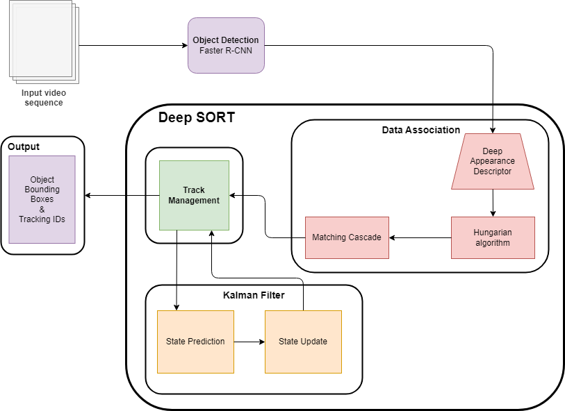

# Sports Analytics - Object Tracking and Kalman Filters

## Task 1: Deep-SORT (40 points)

Diagram of Deep-SORT algorithm:
<p align="center">

</p>

### Key Components:
1. *Object Detection:* This module is in charge of detecting objects in each frame of the input video sequence and create bounding boxes for each object in the frame. In our case, we use a pre-trained Faster R-CNN model, PyTorch's `fasterrcnn_resnet50_fpn_v2`. 

2. *Deep Appearance Descriptor:* The Object Detection module then sends its output as inputs to the Deep Appearance Descriptor. The Deep Appearance Descriptor module is part of the Data Association phase and is a convolutional neural network that extracts feature vectors for detected objects. These feature vectors are not affected by occlusion, lighting, or positioning.

3. *Hungarian algorithm:* The Hungarian algorithm is used to compute the optimal assignment of detections across frames in the Data Association phase of the Deep SORT algorithm. It uses an association metric that measures bounding box overlap.

4. *Matching Cascade:* In order to mitigate the issue of occlusion in object tracking, the Matching Cascade step solves the assignment problem in a seres of subproblems rather than using a global assignment approach. The longer an object is occluded, the more uncertain subsequent Kalman filter predictions associated with the object location are. Matching cascade gives priority to more frequently seen objects.

5. *Tracking Management:* When objects enter or leave the image, tracking IDs must be created or destroyed accordingly. Tracking Management phase either outputs the final video sequence with the object bounding boxes and tracking IDs or outputs to the Kalman Filter stage.

6. *Kalman Filter:* The Kalman Filter is a recursive algorithm that estimates continuous state variables (position and velocity of an object) from noisy observations over time. There are two parts to the Kalman Filter: the *prediction* stage and the *update* stage. The benefit to the Kalman Filter is that due to its recurrent nature, the filter can incorporate new information as it becomes available and refine its estimates due to this new information and past estimates. 

    An object is described by the parameters $u, v, s$ for its position, ${\dot u}, {\dot v}, {\dot s}$ for its velocity, and $r$ for the aspect ratio of the bounding box, such that we have: 
    $$\mathbf{x} = [u, v, s, r, {\dot u}, {\dot v}, {\dot s}]^T$$

    At the *prediction* stage, the previous state estimate, $\mathbf{x}_{k-1}$, and state transition model, $\mathbf{F}_{k}$, are used to predict the current state. The following equations are used:

    - Predicted state estimate: $\hat{\mathbf{x}}_{k|k-1} = \mathbf{F}_k \mathbf{x}_{k-1|k-1}$
    - Predicted covariance estimate: $\hat{\mathbf{P}}_{k|k-1} = \mathbf{F}_k \mathbf{P}_{k-1|k-1} \mathbf{F}_k^T + \mathbf{Q}_k$, where $\mathbf{Q}_k$ is the covariance of the process noise

    At the *update* stage, current observations are combined with the prediction to obtain a new state estimate. The following equations are used:

    - Measurement pre-fit residual: $\tilde{\mathbf{y}}_k = \mathbf{z}_k - \mathbf{H}_k \hat{\mathbf{x}}_{k|k-1}$, where $\mathbf{z}_k$ is the observation of $\mathbf{x}_k$ given by the equation $\mathbf{z}_k = \mathbf{H}_k \mathbf{x}_k + \mathbf{v}_k$, and $\mathbf{H}_k$ is the observation model and $\mathbf{v}_k$ is the observation noise.
    - Residual covariance: $\mathbf{S}_k = \mathbf{H}_k \hat{\mathbf{P}}_{k|k-1} \mathbf{H}_k^T + \mathbf{R}_k$, where $\mathbf{R}_k$ is the covariance of the noise.
    - Kalman gain: $\mathbf{K}_k = \hat{\mathbf{P}}_{k|k-1} \mathbf{H}_k^T \mathbf{S}_k^{-1}$
    - Updated state estimate: $\mathbf{x}_{k|k} = \hat{\mathbf{x}}_{k|k-1} + \mathbf{K}_k \tilde{\mathbf{y}}_k$
    - Updated covariance estimate: $\mathbf{P}_{k|k} = (\mathbf{I} - \mathbf{K}_k \mathbf{H}_k) \hat{\mathbf{P}}_{k|k-1}$
    - Measurement post-fit residual: $\tilde{\mathbf{y}}_{k|k} = \mathbf{z}_k - \mathbf{H}_k \mathbf{x}_{k|k}$

## Task 2: Deep-SORT Implementation (50 points)

This repository contains code that implements Deep-SORT with PyTorch's Faster R-CNN models for object detection. 

Install the requirements:
```
pip install -r requirements.txt
```

The input video is `Football_match.mp4`. 

In order to run the program:
```
python demo.py
```

The output will be located at `output/output.mp4`.

### References:

- Deep-SORT repository: https://github.com/nwojke/deep_sort
- Deep-SORT with YOLOv3 repository: https://github.com/anushkadhiman/ObjectTracking-DeepSORT-YOLOv3-TF2
- DeepSORT with YOLOv3 Kaggle notebook: https://www.kaggle.com/code/sakshaymahna/deepsort/notebook
- Faster R-CNN Object Detection with PyTorch: https://learnopencv.com/faster-r-cnn-object-detection-with-pytorch/

## Task 3: Critique (10 points)

When an object is occluded, the Deep-SORT algorithm will fail to assign the object its original tracking ID in subsequent frames. You can notice this with our output video especially with the sports ball. Everytime the sports ball is occluded, you can see that a different ID will be assigned to it in later frames when it reappears. This is also noticeable with several players in the video as well. 